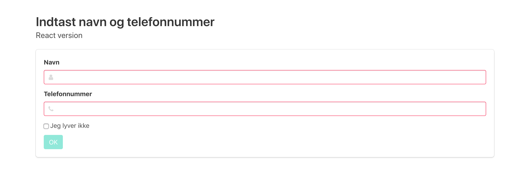

# Single Page Application med React

Et meget lille eksempel på en Single Page Application (SPA), udviklet med [React](https://reactjs.org/)



Eksemplet viser blandt andet:

 * Opsætning af Webpack og Babel
 * Test med Jest og Enzyme
 * Validering af input i en formular

## Sådan kommer du igang

### Installer _NPM_

Følg disse [instruktioner](http://blog.teamtreehouse.com/install-node-js-npm-windows) for at installere Node og NPM i Windows

### Du får brug for en editor
Word eller Notepad er ikke velegnet til software udvikling. Du skal have en ordentlig editor som [Visual Studio Code](https://code.visualstudio.com/), [Atom](https://atom.io/) eller [Sublime Text](https://www.sublimetext.com/3)

Når du har installeret npm kan du prøve at starte applikationen lokalt:
```
    npm start
```

Du kan også prøve at køre test med:
```
    npm test
```


